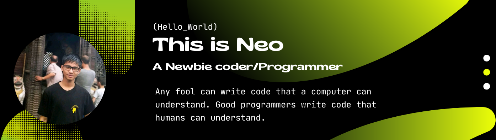

<!-- 

  

 -->

<h1 align="center">Hi there, I'm Nirmal! 👋</h1>

  

  
> *"In the end, we will remember not the words of our enemies, but the silence of our friends."* <!-- dynamic_quote -->
  

 

 
  

  

    
   **⚡ About Me**
   
   - 🔭 **I’m currently working on**: SEO & Web Development
   - 🌱 **I’m currently learning**: SEO
   - 👯 **Interests**: Explore, Experiment, and Implement
   - 🎨 **Hobbies**: Coding, Writing, Music, Martial Arts
   - 💬 **Pronouns**: He/Him/His
   - 📫 **Contact**: [nirmalrokamagar54@gmail.com](mailto:nirmalrokamagar54@gmail.com)

    
   
   **📜 Favorite Poem**
   
> *"How do I love thee? Let me count the ways..."* <!-- dynamic_poem -->
  

 

<h2 align="center">🚀 Tech Stack</h2>

  
  **Languages** 
  
  
  
  
  

   **Frontend** 
  
  
  
  

   **Backend & Database** 
  
  
  
  

   **Tools** 
  
  
  
  
  
  
  
  

 

<h2 align="center">📊 GitHub Stats</h2>

  
  

 

  
   
  

 

<h2 align="center">⚡ Activity Graph</h2>

  

 

  

 

<h2 align="center">📫 Connect with me</h2>

  
  
  
  

 

Visitor count 

